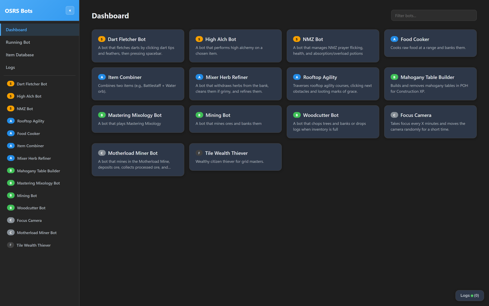
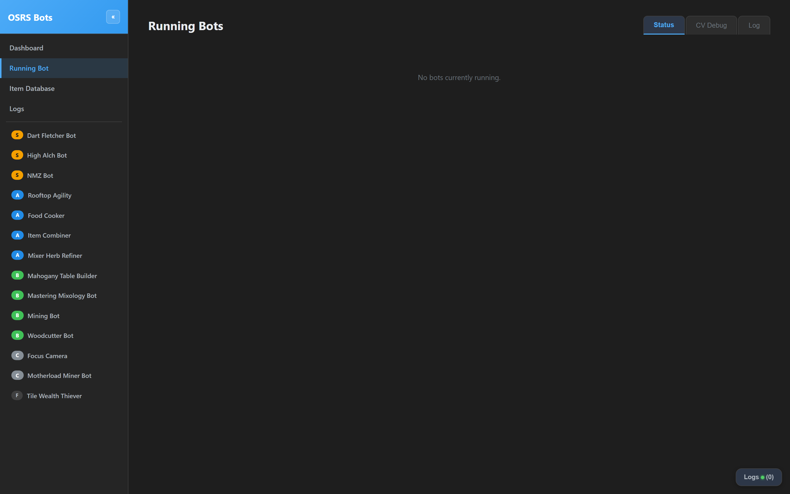
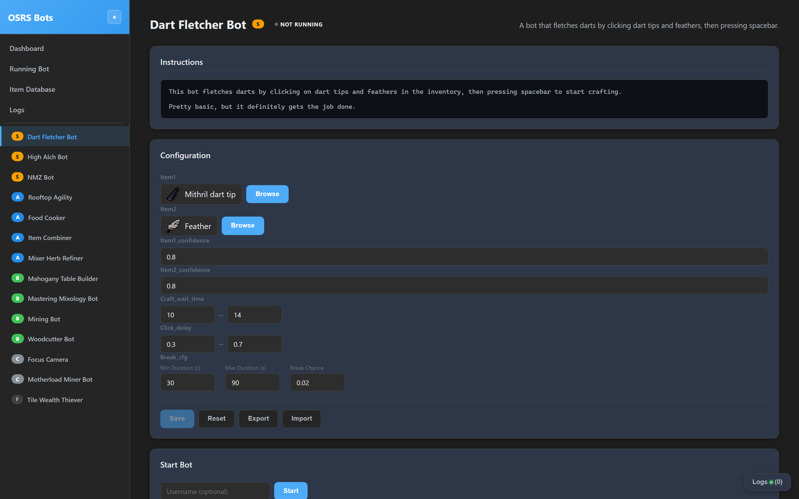

# Old-school RuneScape Computer Vision Bot

A vibe-coding experiment that has grown into a pretty impressive botting framework.

I wouldn't recommend using this if you aren't willing to get your hands dirty writing some Python.

**Windows only.** macOS / Linux backends exist in `core/input/` but aren't actively tested.

### Recent

- **Bank interface rewritten** for the Jagex bank redesign — bank-heavy bots work again.
- **Item database refreshed** including sailing items. Shoutout to [DayV-git/osrsreboxed-db](https://github.com/DayV-git/osrsreboxed-db/tree/master).
- **New web UI (`ui_v2`)** — React + FastAPI, served by a single Python process. No Node.js needed to run it.

## Quick Start

**Prerequisites (Windows):**

| What | Why | Where |
|---|---|---|
| Python >= 3.10 | Runs everything | [python.org](https://www.python.org/downloads/) |
| RuneLite | The game client the bots see and click | [runelite.net](https://runelite.net/) |
| Tesseract OCR | Reads chat, item counts, hover text | [UB Mannheim installer](https://github.com/UB-Mannheim/tesseract/wiki) — install to the default `C:\Program Files\Tesseract-OCR\` |

You do **not** need Node.js. The frontend is pre-built and committed to the repo; the Python server serves it directly.

```powershell
git clone https://github.com/mdennis281/OSRS-CV-Bot.git
cd OSRS-CV-Bot

python -m venv .venv
.venv\Scripts\Activate.ps1
pip install -r requirements.txt

python main.py
```

Open **http://localhost:8010**, pick a bot, configure, run. Use **Page Up** to terminate and **Page Down** to pause/resume any running bot.

### CLI Options

| Flag | Description |
|---|---|
| `--port PORT` | Override the server port (default: 8010) |
| `--host HOST` | Bind address (default: 0.0.0.0) |
| `--cv-debug` | Also start the CV debug server on port 5055 (powers the in-UI CV debug viewer) |
| `--reloader` | Dev mode with hot-reload — requires Node.js, see [CONTRIBUTING.md](CONTRIBUTING.md) |

## Demos

### Item Combiner - [item_combiner.py](./bots/item_combiner.py)

https://github.com/user-attachments/assets/8d7b6eb6-8b16-466c-b32c-9fde9a23fa37

### Rooftop Agility - [agility.py](./bots/agility.py)

https://github.com/user-attachments/assets/226daf47-361a-433d-89e3-dad1afb1c87a

### Web UI





### Computer Vision Debugger


## Running Bots Directly

For bots with complex params (e.g. item lists), you can bypass the UI:

```python
from bots.master_mixer import BotConfig, BotExecutor

config = BotConfig()
bot = BotExecutor(config)
bot.start()
```

## Project Structure

```
main.py                 Entry point
core/                   Framework & services (client, movement, banking, etc.)
bots/                   Bot implementations
ui_v2/
  server.py             Server orchestration (production & dev modes)
  backend/              FastAPI API, WebSocket bridge, services
  frontend/             React + TypeScript SPA (Vite)
    dist/               Pre-built static files (committed)
    src/                Source (only needed for frontend development)
data/                   Item databases, configs, fonts, UI assets
```

### Bot Hotkeys 
- **Page Up**: Terminate the bot immediately
- **Page Down**: Pause/Resume the bot

NOTE: the bot script architecture is migrating from legacy (scripts defined in base dir) to the new bot architecture defined in [./bots](bots/). Invocation of the new architecture can be seen above.

The new architecture has a core bot class defined here [Bot()](core/bot.py). This Bot() class is used as a way to have all the core components (RuneLiteClient(), ScriptControl(), MovementOrchestrator(), BankInterface(), ItemLookup()) all in one class.

Noteworthy scripts:
- [High Alchemy](./bots/high_alch.py)
- [Motherload Miner](./bots/motherload_miner.py)
- [Mastering Mixology](./bots/master_mixer.py)
- [Nightmare Zone](./bots/nmz.py)
